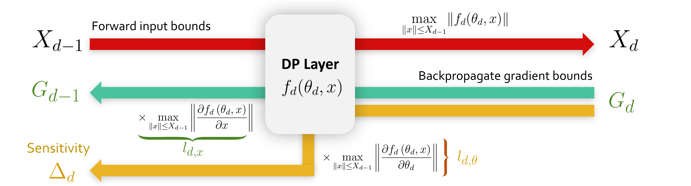
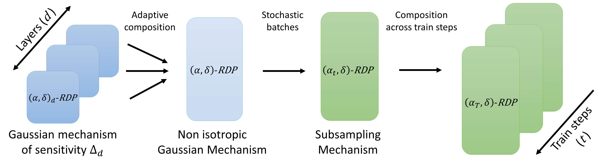

<!-- Banner section -->
<div align="center">
        <picture>
                <source media="(prefers-color-scheme: dark)" srcset="./docs/assets/banner_dark.png">
                <source media="(prefers-color-scheme: light)" srcset="./docs/assets/banner_light.png">
                
        </picture>
</div>
<br>

<!-- Badge section -->
<div align="center">
    <a href="#">
        
    </a>
    <a href="#">
        
    </a>
</div>
<br>

<!-- Short description of your library -->
<p align="center">
  <b>LipDP</b> is a Python toolkit dedicated to make people happy and fun.


Conventionally, Differentially Private ML training relies on Gradient Clipping to guarantee verifiable privacy guarantees.
By using 1-Lipschitz networks developped by the deel-lip project. We can propose a new alternative to gradient clipping based
DP ML. Indeed, by theoretically bounding the value of the sensitivity of our 1-Lipschitz layers, we can directly calibrate a
batchwise noising of the gradients to guarantee (epsilon,delta)-DP.



Therefore the computation time is competitive with existing methods.

## 📚 Table of contents

- [📚 Table of contents](#-table-of-contents)
- [🔥 Tutorials](#-tutorials)
- [🚀 Quick Start](#-quick-start)
- [📦 What's Included](#-whats-included)
- [👍 Contributing](#-contributing)
- [👀 See Also](#-see-also)
- [🙏 Acknowledgments](#-acknowledgments)
- [👨‍🎓 Creator](#-creator)
- [🗞️ Citation](#-citation)
- [📝 License](#-license)

## 🔥 Tutorials

We propose some tutorials to get familiar with the library and its api:

- [Getting started](https://colab.research.google.com/drive/1XproaVxXjO9nrBSyyy7BuKJ1vy21iHs2) <sub> [](https://colab.research.google.com/github/deel-ai/<libname>/blob/master/docs/notebooks/demo_fake.ipynb) </sub>

You do not necessarily need to register the notebooks on the GitHub. Notebooks can be hosted on a specific [drive](https://drive.google.com/drive/folders/1DOI1CsL-m9jGjkWM1hyDZ1vKmSU1t-be).

## 🚀 Setup

lipDP requires some stuff and several libraries including Numpy. Installation can be
 done using Pypi:

```python
pip install -e .[dev]
```

### Setup privacy parameters

### Setup DP model

### Setup accountant

The privacy accountant is composed of different mechanisms from `autodp` package that are combined to provide a privacy accountant for Clipless DP-SGD algorithm:




Adding a privacy accountant to your model is straighforward:

```python
from deel.lipdp.model import DP_Accountant

callbacks = [
  DP_Accountant()
]
```

## 📦 What's Included

Code can be found in the `lipdp` folder, the documentation ca be found by running
 `mkdocs build` and `mkdocs serve` (or loading `site/index.html`). Experiments were
  done using the code in the `experiments` folder.

## 👍 Contributing

Feel free to propose your ideas or come and contribute with us on the Libname toolbox! We have a specific document where we describe in a simple way how to make your first pull request: [just here](CONTRIBUTING.md).

### pre-commit : Conventional Commits 1.0.0

The commit message should be structured as follows:

```
<type>[optional scope]: <description>

[optional body]

[optional footer(s)]

```

The commit contains the following structural elements, to communicate intent to the consumers of your library:

- fix: a commit of the type fix patches a bug in your codebase (this correlates with PATCH in Semantic Versioning).

- feat: a commit of the type feat introduces a new feature to the codebase (this correlates with MINOR in Semantic Versioning).

- BREAKING CHANGE: a commit that has a footer BREAKING CHANGE:, or appends a ! after the type/scope, introduces a breaking API change (correlating with MAJOR in Semantic Versioning). A BREAKING CHANGE can be part of commits of any type.

- types other than fix: and feat: are allowed, for example @commitlint/config-conventional (based on the the Angular convention) recommends *build:, chore:, ci:, docs:, style:, refactor:, perf:, test:*, and [others](https://delicious-insights.com/fr/articles/git-hooks-et-commitlint/).

Other tools to perform DP-training include:

- [tensorflow-privacy](https://github.com/tensorflow/privacy) in Tensorflow
- [Opacus](https://opacus.ai/) in Pytorch
- [jax-privacy](https://github.com/google-deepmind/jax_privacy) in Jax
 
- footers other than BREAKING CHANGE: <description> may be provided and follow a convention similar to git trailer format.

- Additional types are not mandated by the Conventional Commits specification, and have no implicit effect in Semantic Versioning (unless they include a BREAKING CHANGE). A scope may be provided to a commit’s type, to provide additional contextual information and is contained within parenthesis, e.g., feat(parser): add ability to parse arrays.


## 🙏 Acknowledgments


## 👨‍🎓 Creators

If you want to highlights the main contributors


## 🗞️ Citation

If you use Libname as part of your workflow in a scientific publication, please consider citing the 🗞️ [our paper](https://arxiv.org/abs/2305.16202):

```
@article{bethune2023dp,
  title={DP-SGD Without Clipping: The Lipschitz Neural Network Way},
  author={B{\'e}thune, Louis and Mass{\'e}na, Thomas and Boissin, Thibaut and Prudent, Yannick and Friedrich, Corentin and Mamalet, Franck and Bellet, Aurelien and Serrurier, Mathieu and Vigouroux, David},
  journal={arXiv preprint arXiv:2305.16202},
  year={2023}
}
```

## 📝 License

The package is released under [MIT license](LICENSE).
