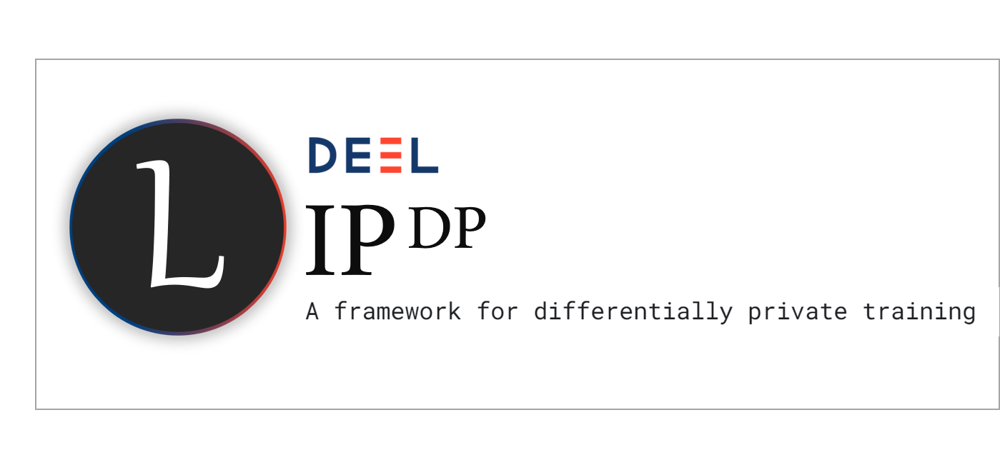

<!-- Banner section -->
<div align="center">
        <picture>
                <source media="(prefers-color-scheme: dark)" srcset="./docs/assets/banner_dark.png">
                <source media="(prefers-color-scheme: light)" srcset="./docs/assets/banner_light.png">
                
        </picture>
</div>
<br>

<!-- Badge section -->
<div align="center">
    <a href="#">
        
    </a>
    <a href="#">
        
    </a>
</div>
<br>

<!-- Short description of your library -->
<p align="center">
  <b>LipDP</b> is a Python toolkit dedicated to differentially private training of 1-Lipschitz networks.

  <!-- Link to the documentation -->
  <br>
  <a href="https://www.youtube.com/watch?v=dQw4w9WgXcQ"><strong>Explore Libname docs »</strong></a>
  <br>

</p>

# Purpose of this library :

Conventionally, Differentially Private machine learning relies on gradient clipping to guarantee verifiable privacy guarantees.
By using 1-Lipschitz networks developped by the deel-lip project. We can propose a new alternative to gradient clipping based on 
theoretically obtained gradient bounds. Indeed, by theoretically bounding the value of the sensitivity of our 1-Lipschitz layers, 
we can directly calibrate a batchwise noisifying of the gradients to guarantee $(\epsilon,\delta)$-DP.

This framework allows for fast and intuitive training of differentially private networks. To test our methods on the MNIST
and CIFAR10 datasets, please refer to the tutorials folder of the repository.  


# Status of the repository : 

- Compatibility issues are to be addressed soon.
- Dynamic gradient clipping is unavailable with the Multiclass HKR loss function. 

## 📚 Table of contents

- [📚 Table of contents](#-table-of-contents)
- [🔥 Tutorials](#-tutorials)
- [🚀 Quick Start](#-quick-start)
- [📦 What's Included](#-whats-included)
- [👍 Contributing](#-contributing)
- [👀 See Also](#-see-also)
- [🙏 Acknowledgments](#-acknowledgments)
- [👨‍🎓 Creator](#-creator)
- [🗞️ Citation](#-citation)
- [📝 License](#-license)

## 🔥 Tutorials

We propose some tutorials to get familiar with the library and its api:

| **Tutorial Name**           | Notebook                                                                                                                                                           |
| :-------------------------- | :----------------------------------------------------------------------------------------------------------------------------------------------------------------: |
| MNIST Classification          | [](https://colab.research.google.com/github/deel-ai/deel-lipdp/blob/master/docs/notebooks/mnist_train.ipynb)            |
| CIFAR10 Classification        | [](https://colab.research.google.com/github/deel-ai/deel-lipdp/blob/master/docs/notebooks/cifar_train.ipynb) |

## 🚀 Quick Start

LipDP has some dependancies given in the 'requirements.txt' file. Installation can be done using Pypi:

```python
pip install lipdp
```
## 📦 What's Included

* Loader for tensorflow datasets. 
* Keras like 1-Lipschitz DP models (Sequential and Model). 
* Custom DP loss functions.
* Custom DP layer objects. 
* Custom training process with $(\epsilon,\delta)$-DP guarantees through a callback. 
* Adaptive loss gradient clipping as a callback leveraging the SVT method. 

## 👍 Contributing

Feel free to propose your ideas or come and contribute with us on the Libname toolbox! We have a specific document where we describe in a simple way how to make your first pull request: [just here](CONTRIBUTING.md).

## 👀 See Also

More from the DEEL project:

- [Xplique](https://github.com/deel-ai/xplique) a Python library exclusively dedicated to explaining neural networks.
- [deel-lip](https://github.com/deel-ai/deel-lip) a Python library for training k-Lipschitz neural networks on TF.
- [Influenciae](https://github.com/deel-ai/influenciae) Python toolkit dedicated to computing influence values for the discovery of potentially problematic samples in a dataset.
- [deel-torchlip](https://github.com/deel-ai/deel-torchlip) a Python library for training k-Lipschitz neural networks on PyTorch.
- [DEEL White paper](https://arxiv.org/abs/2103.10529) a summary of the DEEL team on the challenges of certifiable AI and the role of data quality, representativity and explainability for this purpose.

## 🙏 Acknowledgments

<div align="right">
  <picture>
    <source media="(prefers-color-scheme: dark)" srcset="https://share.deel.ai/apps/theming/image/logo?useSvg=1&v=10"  width="25%" align="right">
    <source media="(prefers-color-scheme: light)" srcset="https://www.deel.ai/wp-content/uploads/2021/05/logo-DEEL.png"  width="25%" align="right">
    
  </picture>
</div>
This project received funding from the French ”Investing for the Future – PIA3” program within the Artificial and Natural Intelligence Toulouse Institute (ANITI). The authors gratefully acknowledge the support of the <a href="https://www.deel.ai/"> DEEL </a> project.

## 👨‍🎓 Creators

If you want to highlights the main contributors


## 🗞️ Citation

If you use LipDP as part of your workflow in a scientific publication, please consider citing our paper introducing the 
method [DP-SGD Without Clipping : The Lipschitz Neural Network Way](https://arxiv.org/abs/2305.16202).
:

```
@misc{bethune2023dpsgd,
      title={DP-SGD Without Clipping: The Lipschitz Neural Network Way}, 
      author={Louis Bethune and Thomas Massena and Thibaut Boissin and Yannick Prudent and Corentin Friedrich and Franck Mamalet and Aurelien Bellet and Mathieu Serrurier and David Vigouroux},
      year={2023},
      eprint={2305.16202},
      archivePrefix={arXiv},
      primaryClass={cs.LG}
}
```

## 📝 License

The package is released under [MIT license](LICENSE).
