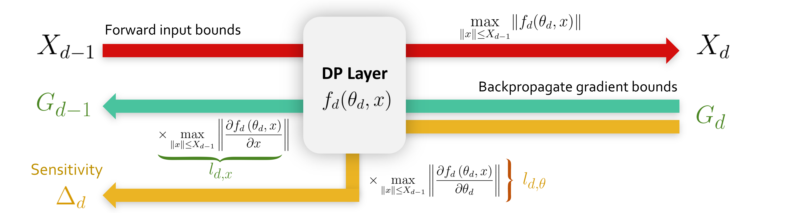

<p align="center">
<!-- Badge section -->
<div align="center">
    <a href="#">
        
    </a>
    <a href="https://github.com/deel-ai/lipdp/actions/workflows/tests.yml">
        
    </a>
    <a href="https://github.com/deel-ai/lipdp/actions/workflows/python-linters.yml">
        
    </a>
    <a href="#">
        
    </a>
</div>
</p>

<!-- Short description of your library -->
<b>LipDP</b> is a Python toolkit dedicated to robust and certifiable learning under privacy guarantees.  
  
  

This package is the code for the paper "*DP-SGD Without Clipping: The Lipschitz Neural Network Way*" by Louis Béthune, Thomas Massena, Thibaut Boissin, Aurélien Bellet, Franck Mamalet, Yannick Prudent, Corentin Friedrich, Mathieu Serrurier, David Vigouroux, published at the **International Conference on Learning Representations (ICLR 2024)**. The paper is available on [arxiv](https://arxiv.org/abs/2305.16202).   
  
  
State-of-the-art approaches for training Differentially Private (DP) Deep Neural Networks (DNN) face difficulties to estimate tight bounds on the sensitivity of the network's layers, and instead rely on a process of per-sample gradient clipping. This clipping process not only biases the direction of gradients but also proves costly both in memory consumption and in computation. To provide sensitivity bounds and bypass the drawbacks of the clipping process, we propose to rely on Lipschitz constrained networks. Our theoretical analysis reveals an unexplored link between the Lipschitz constant with respect to their input and the one with respect to their parameters. By bounding the Lipschitz constant of each layer with respect to its parameters, we prove that we can train these networks with privacy guarantees.  Our analysis not only allows the computation of the aforementioned sensitivities at scale, but also provides guidance on how to maximize the gradient-to-noise ratio for fixed privacy guarantees. To facilitate the application of Lipschitz networks and foster robust and certifiable learning under privacy guarantees, we provide this Python package that implements building blocks allowing the construction and private training of such networks.  

<div align="center">
  
</div>

The sensitivity is computed automatically by the package, and no element-wise clipping is required. This is translated into a new DP-SGD algorithm, called Clipless DP-SGD, that is faster and more memory efficient than DP-SGD with clipping.

<div align="center">
  
</div>

## 📚 Table of contents

- [📚 Table of contents](#-table-of-contents)
- [🔥 Tutorials](#-tutorials)
- [🚀 Quick Start](#-quick-start)
- [📦 What's Included](#-whats-included)
- [👀 See Also](#-see-also)
- [🙏 Acknowledgments](#-acknowledgments)
- [👨‍🎓 Creator](#-creator)
- [🗞️ Citation](#-citation)
- [📝 License](#-license)

## 🔥 Tutorials

We propose some tutorials to get familiar with the library and its API:

- **Demo on MNIST** <sub> [](https://colab.research.google.com/drive/1s3LBIxf0x1sOMQUw6BHpxbeUzmwtaP0d) </sub>
- **Demo on CIFAR10** <sub> [](https://colab.research.google.com/drive/1RbALHN-Eib6CCUznLrbiETX7JJrFaUB0) </sub>

## 🚀 Quick Start

lipDP requires some stuff and several libraries including Numpy. Installation can be done locally by cloning the repository and running:
```python
pip install -e .[dev]
```

### Setup privacy parameters

Parameters are stored in a dataclass:

```python
from deel.lipdp.model import DPParameters
dp_parameters = DPParameters(
    noisify_strategy="local",
    noise_multiplier=4.0,
    delta=1e-5,
)

epsilon_max = 10.0
```

### Setup DP model

```python
# construct DP_Sequential
model = DP_Sequential(
    # works like usual sequential but requires DP layers
    layers=[
        # BoundedInput works like Input, but performs input clipping to guarantee input bound
        layers.DP_BoundedInput(
            input_shape=dataset_metadata.input_shape, upper_bound=input_upper_bound
        ),
        layers.DP_QuickSpectralConv2D( # Reshaped Kernel Orthogonalization (RKO) convolution.
            filters=32,
            kernel_size=3,
            kernel_initializer="orthogonal",
            strides=1,
            use_bias=False,  # No biases since the framework handles a single tf.Variable per layer.
        ),
        layers.DP_GroupSort(2),  # GNP activation function.
        layers.DP_ScaledL2NormPooling2D(pool_size=2, strides=2),  # GNP pooling.
        layers.DP_QuickSpectralConv2D( # Reshaped Kernel Orthogonalization (RKO) convolution.
            filters=64,
            kernel_size=3,
            kernel_initializer="orthogonal",
            strides=1,
            use_bias=False,  # No biases since the framework handles a single tf.Variable per layer.
        ),
        layers.DP_GroupSort(2),  # GNP activation function.
        layers.DP_ScaledL2NormPooling2D(pool_size=2, strides=2),  # GNP pooling.
        
        layers.DP_Flatten(),   # Convert features maps to flat vector.
        
        layers.DP_QuickSpectralDense(512),  # GNP layer with orthogonal weight matrix.
        layers.DP_GroupSort(2),
        layers.DP_QuickSpectralDense(dataset_metadata.nb_classes),
    ],
    dp_parameters=dp_parameters,
    dataset_metadata=dataset_metadata,
)
```

### Setup accountant

The privacy accountant is composed of different mechanisms from `autodp` package that are combined to provide a privacy accountant for Clipless DP-SGD algorithm:

<div align="center">
  
</div>

Adding a privacy accountant to your model is straighforward:

```python
from deel.lipdp.model import DP_Accountant

callbacks = [
  DP_Accountant()
]

model.fit(
    ds_train,
    epochs=num_epochs,
    validation_data=ds_test,
    callbacks=[
        # accounting is done thanks to a callback
        DP_Accountant(log_fn="logging"),  # wandb.log also available.
    ],
)
```

## 📦 What's Included

Code can be found in the `deel/lipdp` folder, the documentation ca be found by running
 `mkdocs build` and `mkdocs serve` (or loading `site/index.html`). Experiments were
  done using the code in the `experiments` folder.

Other tools to perform DP-training include:

- [tensorflow-privacy](https://github.com/tensorflow/privacy) in Tensorflow
- [Opacus](https://opacus.ai/) in Pytorch
- [jax-privacy](https://github.com/google-deepmind/jax_privacy) in Jax

## 🙏 Acknowledgments

The creators thank the whole [DEEL](https://deel-ai.com/) team for its support, and [Aurélien Bellet](http://researchers.lille.inria.fr/abellet/) for his guidance.  

## 👨‍🎓 Creators

The library has been created by [Louis Béthune](https://github.com/Algue-Rythme), [Thomas Masséna](https://github.com/massena-t) during an internsip at [DEEL](https://deel-ai.com/), and [Thibaut Boissin](https://github.com/thib-s).  

## 🗞️ Citation

If you find this work useful for your research, please consider citing it:

```
@inproceedings{
bethune2024dpsgd,
title={{DP}-{SGD} Without Clipping: The Lipschitz Neural Network Way},
author={Louis B{\'e}thune and Thomas Massena and Thibaut Boissin and Aur{\'e}lien Bellet and Franck Mamalet and Yannick Prudent and Corentin Friedrich and Mathieu Serrurier and David Vigouroux},
booktitle={The Twelfth International Conference on Learning Representations},
year={2024},
url={https://openreview.net/forum?id=BEyEziZ4R6}
}
```

## 📝 License

The package is released under [MIT license](../LICENSE).
